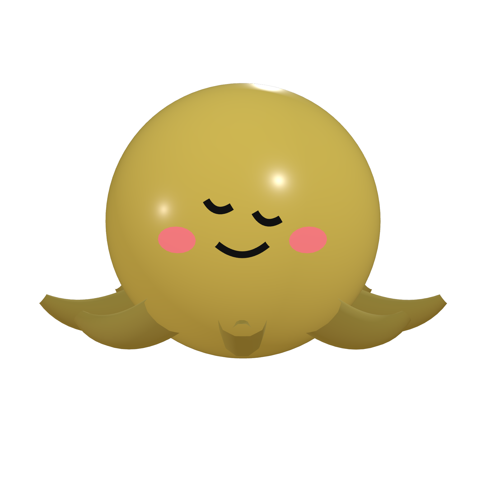
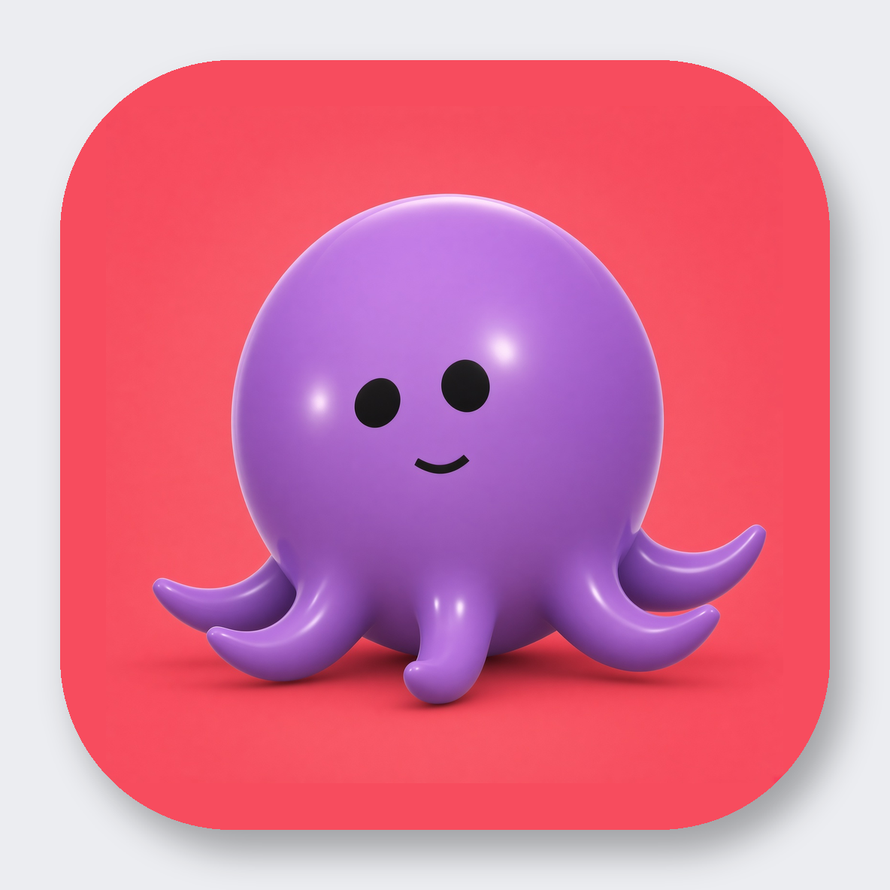
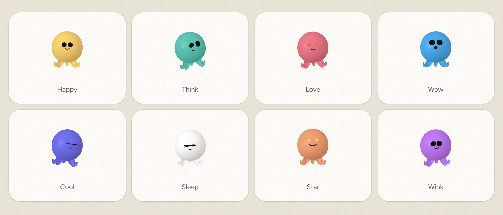

<p align="center">
  
</p>

<h1 align="center">OctoBot</h1>

<p align="center">
  Local desktop assistants that live on their own Linux computers.<br>
  Chat with a Bot. Watch it click, type, and work — never on your Mac.
</p>

<p align="center">
  
</p>

OctoBot is a desktop app for macOS, Windows, and Linux. Each Bot gets an isolated Linux desktop (Docker). You talk in the chat; the Bot uses the computer like a person — screenshot, then mouse and keyboard. Mid-task questions are answered while it keeps working.

The mascot is the Smooth octopus you see in the rail: live Three.js, emoji faces, looping motions.

<p align="center">
  
</p>

## Install

Private repo for now. Grab a build from [Releases](https://github.com/daniel-farina/octobot/releases).

| Platform | Artifact |
|---|---|
| macOS (Apple Silicon) | `OctoBot-0.1.0-mac-arm64.dmg` — signed and notarized |
| macOS (Intel) | `OctoBot-0.1.0-mac-x64.dmg` — signed and notarized |
| Windows | `OctoBot-0.1.0-win-x64.zip` |
| Linux | `OctoBot-0.1.0-linux-x86_64.AppImage` or `OctoBot-0.1.0-linux-x64.tar.gz` |

**macOS:** open the DMG, drag OctoBot to Applications, launch. Gatekeeper should accept it (Developer ID + notarized).

**Windows / Linux:** unzip or run the AppImage.

You also need Docker (Colima on a Mac, or Docker Desktop) so each Bot can have a computer.

## What it does

- Isolated Linux XFCE desktops per Bot — the assistant never touches the host
- Two tunnels: outside computer-use (screenshot / click / type) and inside `docker exec` shell
- SpaceXAI (`grok-4.6`) or Grok Build (OAuth once on this machine, session copied into each VM)
- Live desktop view, mid-task chat, Stop, standing routines
- Cute octopus avatars with faces and motions — browse them at `/tool.html`

## Develop

```bash
# needs Node 20+, Docker or Colima
npm install
export XAI_API_KEY=…          # or use Settings → Harness → Grok Build OAuth
./start.sh                    # server on :8787 + Electron
```

```bash
npm test                      # isolation / tunnel tests
npm run logo                  # Three.js preview render (does not replace the 3D brand logo)
npm run icons                 # icns / ico / png from the mascot
```

Avatars: [docs/avatars.md](docs/avatars.md). Catalog: `http://127.0.0.1:8787/tool.html`.

## Release

Same Apple account as Xnative (`Developer ID Application: Daniel Farina ([redacted])` + App Store Connect API key).

```bash
export XPLORER_NOTARY_KEY="$HOME/.appstoreconnect/private_keys/AuthKey_[redacted].p8"
export XPLORER_NOTARY_KEY_ID="[redacted]"
export XPLORER_NOTARY_ISSUER="[redacted]"
npm run release
```

That builds Mac (signed + notarized DMG/zip), Windows zip, and Linux AppImage/tar.gz into `dist/`.

## Brand

| File | Use |
|---|---|
| [docs/brand/octobot-logo.png](docs/brand/octobot-logo.png) | Transparent 3D octopus logo (2048²) |
| [docs/brand/octobot-logo.mp4](docs/brand/octobot-logo.mp4) | 3D idle animation (6s) |
| [docs/brand/octobot-icon.png](docs/brand/octobot-icon.png) | App icon master (macOS applies the squircle) |
| [docs/brand/octobot-icon-rounded.png](docs/brand/octobot-icon-rounded.png) | Rounded PNG for web / README |
| [docs/brand/octobot-icon-source.png](docs/brand/octobot-icon-source.png) | Official purple octopus still |
| `build/icon.icns` / `build/icon.ico` | Packaged app icons (all sizes) |

Not affiliated with xAI.
