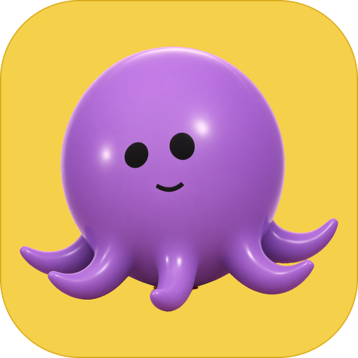
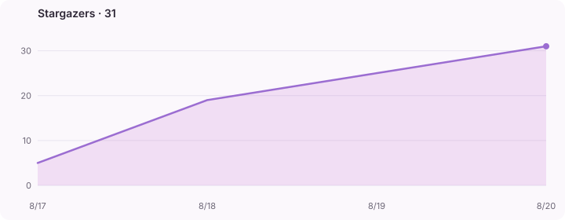

<p align="center">
  
</p>

<h1 align="center">Sub8</h1>

<p align="center">
  Local desktop assistants that live on their own Linux computers.<br>
  Chat with a Bot. Watch it click, type, and work — never on your Mac.
</p>

<p align="center">
  <a href="https://github.com/sub8bot/Sub8/stargazers"></a>
  <a href="https://github.com/sub8bot/Sub8/releases/latest"></a>
  <a href="https://github.com/sub8bot/Sub8/blob/master/LICENSE"></a>
</p>

Sub8 is a desktop app for macOS, Windows, and Linux. Each Bot gets an isolated Linux desktop (Docker). You talk in the chat; the Bot uses the computer like a person — screenshot, then mouse and keyboard. Mid-task questions are answered while it keeps working.

A **team** shares one Linux computer and splits the work: the chief assigns steps, each teammate has a private X display and one Chrome tab, and a job bar tracks pending / running / done / blocked. Page tools (snapshot, click-by-ref) drive websites; pixel tools stay for native UI.

The mascot is the Smooth octopus you see in the rail: live Three.js, emoji faces, looping motions.

<p align="center">
  
</p>

<p align="center">
  <a href="https://github.com/sub8bot/Sub8/stargazers">
    
  </a>
</p>

## Install

Grab a build from [Releases](https://github.com/sub8bot/Sub8/releases/latest).

| Platform | Artifact |
|---|---|
| macOS (Apple Silicon) | [`Sub8-mac-arm64.dmg`](https://github.com/sub8bot/Sub8/releases/latest/download/Sub8-mac-arm64.dmg) — signed and notarized |
| macOS (Intel) | [`Sub8-mac-x64.dmg`](https://github.com/sub8bot/Sub8/releases/latest/download/Sub8-mac-x64.dmg) — signed and notarized |
| Windows | [`Sub8-win-x64.exe`](https://github.com/sub8bot/Sub8/releases/latest/download/Sub8-win-x64.exe) installer, or [`Sub8-win-x64.zip`](https://github.com/sub8bot/Sub8/releases/latest/download/Sub8-win-x64.zip) |
| Linux | [`Sub8-linux-x86_64.AppImage`](https://github.com/sub8bot/Sub8/releases/latest/download/Sub8-linux-x86_64.AppImage) or [`Sub8-linux-x64.tar.gz`](https://github.com/sub8bot/Sub8/releases/latest/download/Sub8-linux-x64.tar.gz) |

**macOS:** open the DMG, drag Sub8 to Applications, launch. Gatekeeper should accept it (Developer ID + notarized).

**Windows:** run the installer (`Sub8-win-x64.exe`), or unzip the portable zip. You need Docker Desktop.

**Linux:** run the AppImage.

You also need Docker (Colima on a Mac, or Docker Desktop) so each Bot can have a computer.

## What it does

- Isolated Linux desks per Bot (slim Debian + Xvfb + Chrome, not a full XFCE webtop) — the assistant never touches the host
- **Teams:** one shared computer, per-member screens (`:1` chief, `:2`–`:8` workers), job progress bar, `message_teammate` / `set_job` / `update_task`
- Page agent (CDP snapshot / click-by-ref) for websites; screenshot / click / type for pixels
- Two tunnels: outside computer-use and inside `docker exec` shell
- SpaceXAI (`grok-4.6`), Claude, Grok Build, Hermes, or Codex as the harness
- Live desktop view, mid-task chat, Stop, standing routines at local wall-clock time
- Cute octopus avatars with faces and motions — browse them at `/tool.html`

## Develop

```bash
# needs Node 20+, Docker or Colima
npm install
export XAI_API_KEY=…          # or use Settings → Harness → Grok Build OAuth
./start.sh                    # server on :8787 + Electron
```

```bash
npm test                      # isolation / tunnel tests
npm run logo                  # Three.js preview render (does not replace the 3D brand logo)
npm run icons                 # icns / ico / png from the mascot
```

Avatars: [docs/avatars.md](docs/avatars.md). Catalog: `http://127.0.0.1:8787/tool.html`.

## Release

```bash
npm run release
```

That writes Mac (signed + notarized when Apple credentials are in the environment), Windows zip, and Linux AppImage/tar.gz into `dist/`. Signing secrets stay on the build machine — never in the repo.

## Brand

| File | Use |
|---|---|
| [docs/brand/octobot-logo.png](docs/brand/octobot-logo.png) | Transparent 3D octopus (2048²) |
| [docs/brand/octobot-logo-rounded.png](docs/brand/octobot-logo-rounded.png) | Rounded coral logo, octopus fills the tile |
| [docs/brand/octobot-logo.mp4](docs/brand/octobot-logo.mp4) | 3D idle animation (6s) |
| [docs/brand/octobot-icon.png](docs/brand/octobot-icon.png) | App icon master (macOS applies the squircle) |
| [docs/brand/octobot-icon-rounded.png](docs/brand/octobot-icon-rounded.png) | Rounded PNG for web / README |
| [docs/brand/octobot-icon-source.png](docs/brand/octobot-icon-source.png) | Official purple octopus still |
| [docs/brand/star-history.svg](docs/brand/star-history.svg) | Stargazers chart (`node scripts/star-history.mjs`) |
| `build/icon.icns` / `build/icon.ico` | Packaged app icons (all sizes) |

Not affiliated with xAI.

## License

[Business Source License 1.1](LICENSE) © 2026 Daniel Farina.

Source is public. You may use, modify, and run Sub8 — including inside a company. You may not offer a competing hosted Sub8 Cloud (always-on computers / agents as a service) to third parties. Each version becomes [MIT](https://opensource.org/licenses/MIT) four years after it is published.

This is **source-available**, not OSI open source, until that change date. The Sub8 Cloud control plane is a separate, private repo.
