# Sub8 architecture

Sub8 (package `sub8bot`) is a local desktop app for **personal bots**. Each bot has:

- a chat thread
- a 3D octopus avatar
- an optional Linux desktop (Docker Webtop + noVNC)
- standing **routines** that wake the bot on a timer

The model (default: Grok via `https://api.x.ai/v1`) never sees the host Mac filesystem. Computer use and shell run only inside that bot’s VM.

This document is a map of how the pieces talk to each other.

---

## 1. High level — what exists

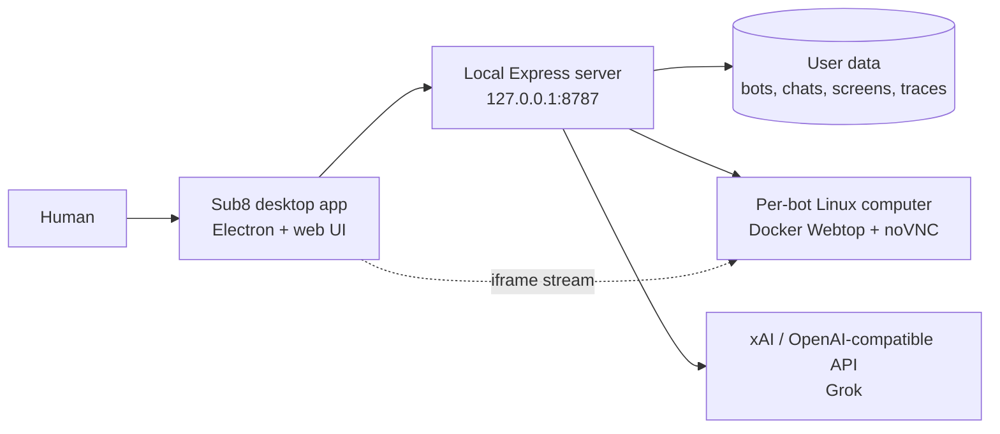

One sentence: **the UI is a client; the Node server is the brain; Docker is the bot’s hands; Grok decides what to do.**

---

## 2. High level — runtime processes

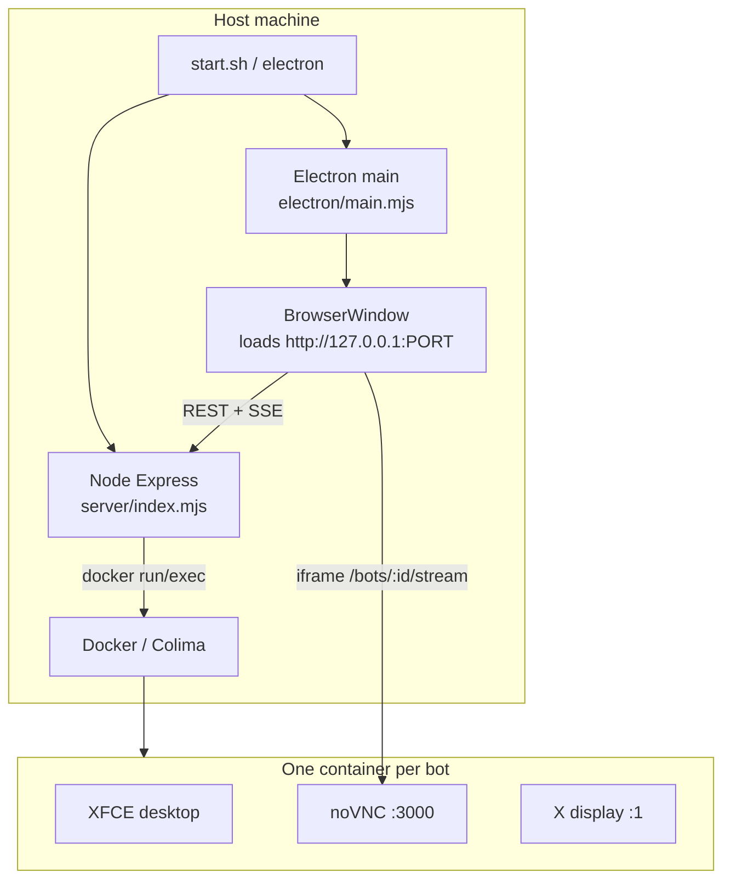

- **Dev:** `zsh start.sh` starts Colima if needed, starts the server if port 8787 is free, then opens the packaged Electron app.
- **Packaged:** Electron `main.mjs` starts `server/index.mjs` as a child unless 8787 is already healthy. Data lives under the app userData folder (`SUB8BOT_DATA`).
- **Port:** Prefer 8787; fall back to 8791–8793 if busy.

---

## 3. High level — request path

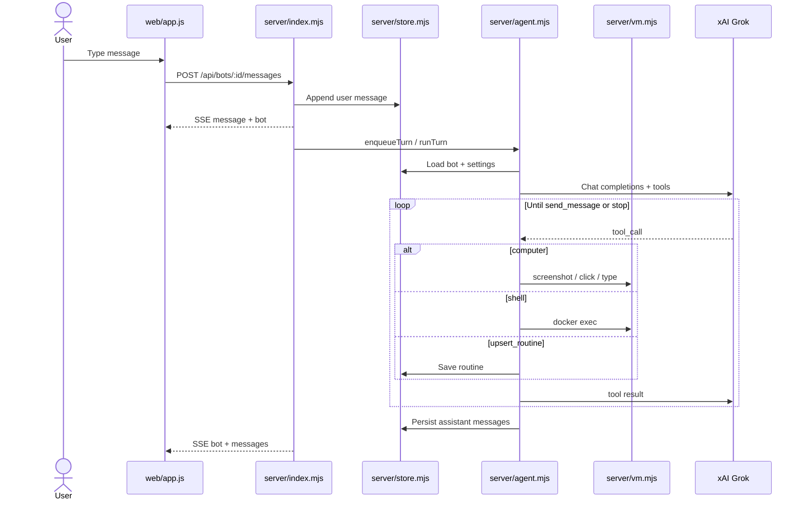

---

## 4. Repository layout

| Path | Role |
|---|---|
| `electron/main.mjs` | Desktop shell, spawn server, window, cache, data migration |
| `server/index.mjs` | HTTP API, SSE, turn queue, static `web/` |
| `server/agent.mjs` | Model client, system prompt, tool loop |
| `server/vm.mjs` | Docker lifecycle, screenshot, input, stream proxy |
| `server/store.mjs` | `bots.json`, conversations, settings, avatar defaults |
| `server/routines.mjs` | Schedule parse, upsert, due routines |
| `server/isolation.mjs` | Host-path block, VM-only shell |
| `server/control.mjs` | Human-is-driving flag (pauses agent input) |
| `server/trace.mjs` | JSONL traces under `data/traces/` |
| `server/paths.mjs` | `appRoot`, unpacked files, `dataDir` |
| `web/app.js` | Main UI: rail, chat, settings, computer pane |
| `web/avatar.js` | Shared Three.js renderer, mood, look sliders |
| `web/grok-bot.js` | Procedural octopus: body, face, motion, color flash |
| `web/tool.html` | Avatar catalog |
| `web/palette.js` | Shared color swatches |
| `prompts/` | System + computer-control text |
| `vm/` | Webtop setup, click-lab |
| `data/` | Runtime state (not the product source) |

---

## 5. Server modules

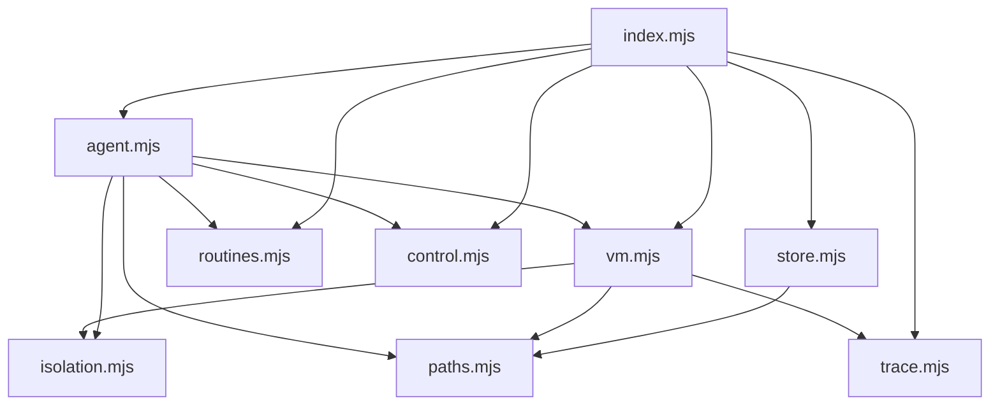

### `index.mjs`

Express app. Serves:

- `/` → `web/index.html`
- `/tool.html` → avatar catalog
- `/vendor/three` → Three.js
- `/api/*` JSON
- `/api/events` Server-Sent Events
- `/api/bots/:id/stream` proxied noVNC (when the VM is up)

Keeps an **in-memory turn queue** per bot (`enqueueTurn`) so two chats do not interleave tools. `busyIds` drives the rail “busy” state. Extra user messages during a turn become **nudges** (or a parallel orchestrator reply if the message looks like a question).

### `store.mjs`

Single-writer access to disk:

- `data/bots.json` — all bots
- `data/conversations/<id>.json` — message arrays
- `data/settings.json` — harness, theme, flags
- `data/screens/<id>.png` — last screenshot

Normalizes missing `avatar` to `{ expression, animation, body: "rounder" }`.

### `agent.mjs`

Builds the model request:

1. Load prompts (`grok-bot-system.txt`, `computer-control.txt`, optional harness extras)
2. Attach bot name, instructions, routines, last messages
3. Call OpenAI-compatible chat with tools: `send_message`, `computer`, `shell`, `upsert_routine`, `list_routines`, …
4. Execute tools against **that bot’s VM only**
5. Loop until the model calls `send_message` or the user hits stop

If `isHumanControl(botId)` the agent must not drive the desktop.

### `vm.mjs`

- Image: `linuxserver/webtop:ubuntu-xfce` (override `LOCALBOT_IMAGE`)
- Container name: `localbot-<botId-prefix>`
- Starts noVNC; assigns a host port from 13100 up
- `computer` actions become xdotool / scrot / clipboard inside the container
- Screenshots are 1024×768; click coordinates are pixels on that image

### Two tunnels (`isolation.mjs`)

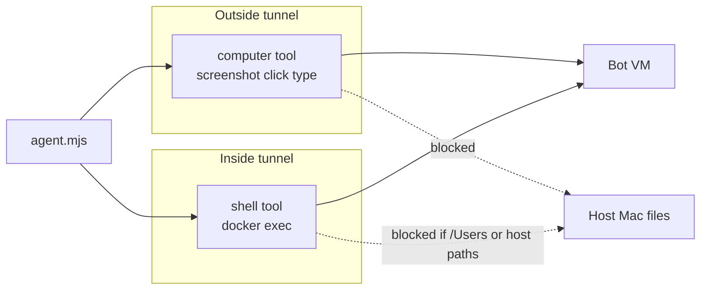

---

## 6. HTTP API

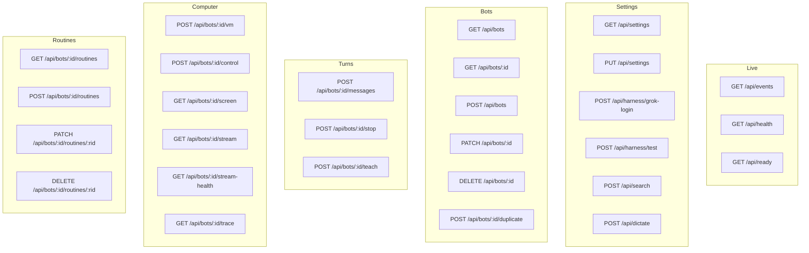

**SSE events** (`/api/events`): `bot`, `message`, `settings`, plus busy/error updates. The UI holds one EventSource and re-renders from those events.

---

## 7. Chat turn in detail

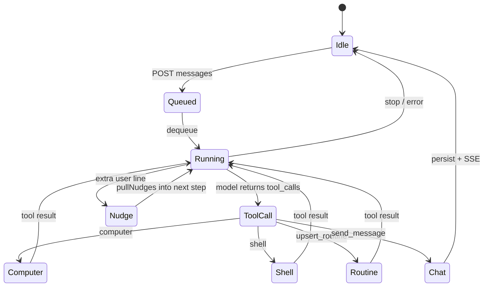

Nudge vs question:

- Short “keep going” text is a **nudge** into the same turn
- A real question can get a side **orchestrator** reply so the user is not ignored while the desktop is busy

`hidden` turns (routines) write fewer user-visible lines.

---

## 8. Routines

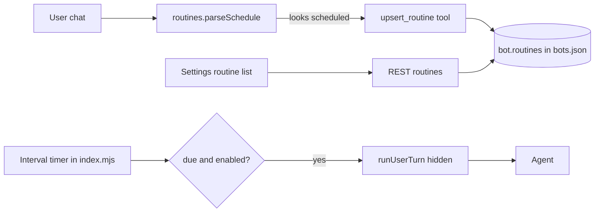

A routine is `{ id, name, instruction, intervalMs, groupKey, enabled, lastRunAt }`. Groups include `general`, `x-inbox`, `email`, `flights`, `calendar`, `files`.

---

## 9. Persistence model

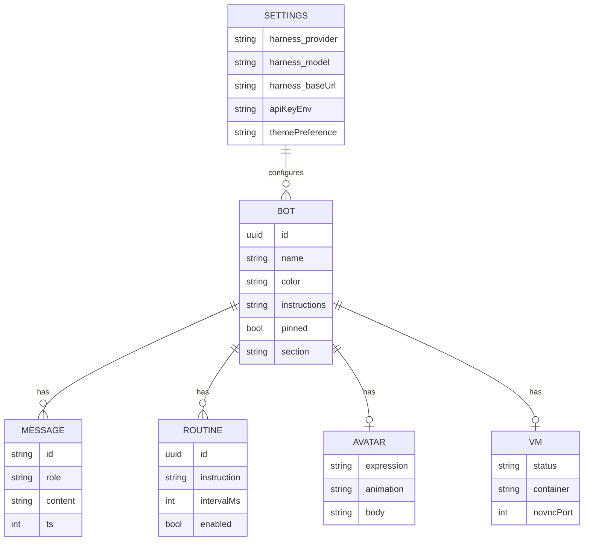

On disk:

```
data/
  bots.json
  settings.json
  conversations/<botId>.json
  screens/<botId>.png
  traces/<botId>.jsonl
```

Packaged app: same shape under `Application Support/Sub8/data` (legacy OctoBot / Sub8Bot folders are copied once).

---

## 10. Frontend — main app

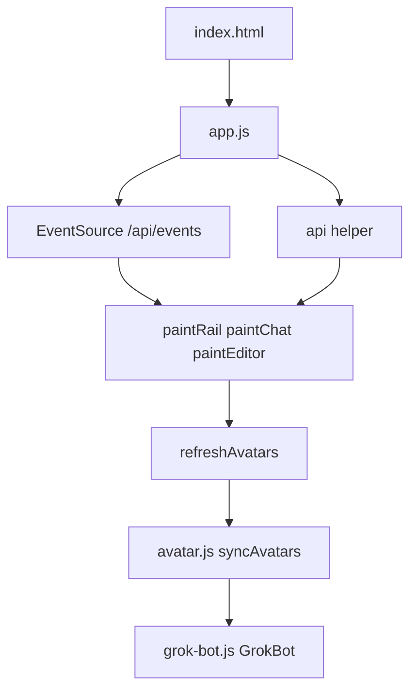

**`app.js` responsibilities**

- Global `state`: bots, selected id, settings, desk size, editor, teach mode
- `render()` / targeted `paint*` functions (avoid wiping focused inputs)
- Chat composer, image attach, dictate (`POST /api/dictate` → Swift on macOS)
- Rail: select, pin, unread, hide, sections
- Bot settings: name, color, **body / face / motion** chips, instructions
- Computer pane: iframe stream, Take control / Give back (`/control`)
- Teach: capture frames, `POST /teach`

**Avatar hook**

Any element:

```html
<div data-avatar="BOT_ID" data-avatar-slot="rail" data-avatar-size="56" data-avatar-framing="body"></div>
```

`refreshAvatars()` collects hooks, runs `inferMood` (or preview), passes `color` + `body`, then `syncAvatars`.

---

## 11. Avatar system

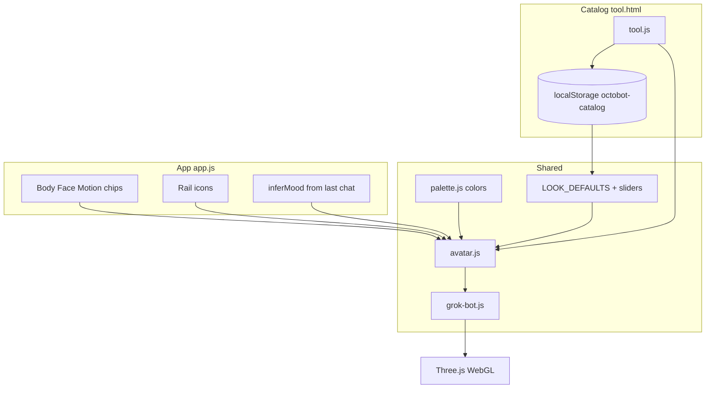

### `grok-bot.js`

Procedural mesh, not a loaded GLB.

- **Body** — sphere deformed by `form` (`mantle` / `rounder` / …) then tentacles attached on the surface
- **Face** — stadium / round / heart / star / line eyes + graphic mouths
- **Motion** — `playAnimation` + `_updateAnim` + tentacle wiggle
- **Flash** — for Cold / Hot / Angry / Rage / Steam / Sick / Love, lerp body color every ~5s

Default body id: **`rounder`**.

### `avatar.js`

- One offscreen `WebGLRenderer`, many views (one per hook)
- Look sliders: gloss, shine size/blur/position, lights, color punch
- Look is stored in `localStorage` key `octobot-catalog` and **also applied in the main app**
- `inferMood`: last user text + VM error + busy/look/talk + idle sleep
- Color expressions pulse via `GrokBot._flashBody` on every `update()` tick

### Catalog (`tool.html`)

Design surface: bodies, faces, motions, colors, look sliders. Does not write bots unless you copy ids into Settings.

---

## 12. Computer pane

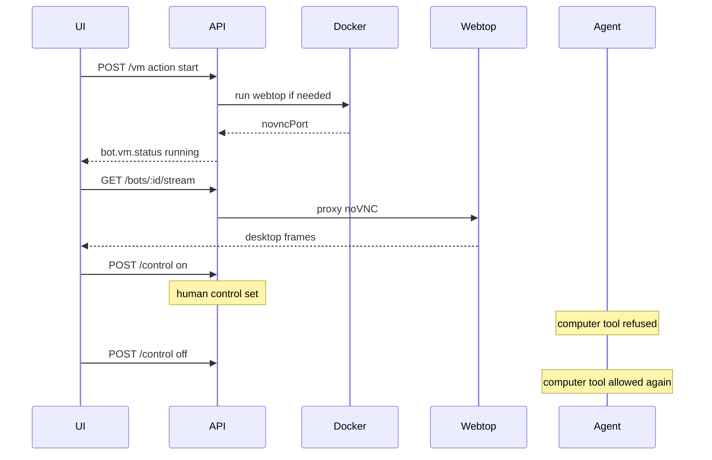

Human control is in-memory only (`control.mjs`). Restarting the server clears it.

---

## 13. Frontend ↔ server events

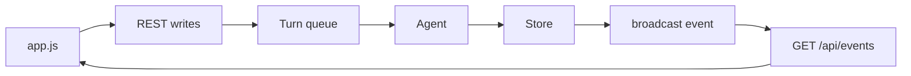

The UI does not poll bots. After the first `GET /api/bots`, it stays live through SSE.

---

## 14. Security boundaries

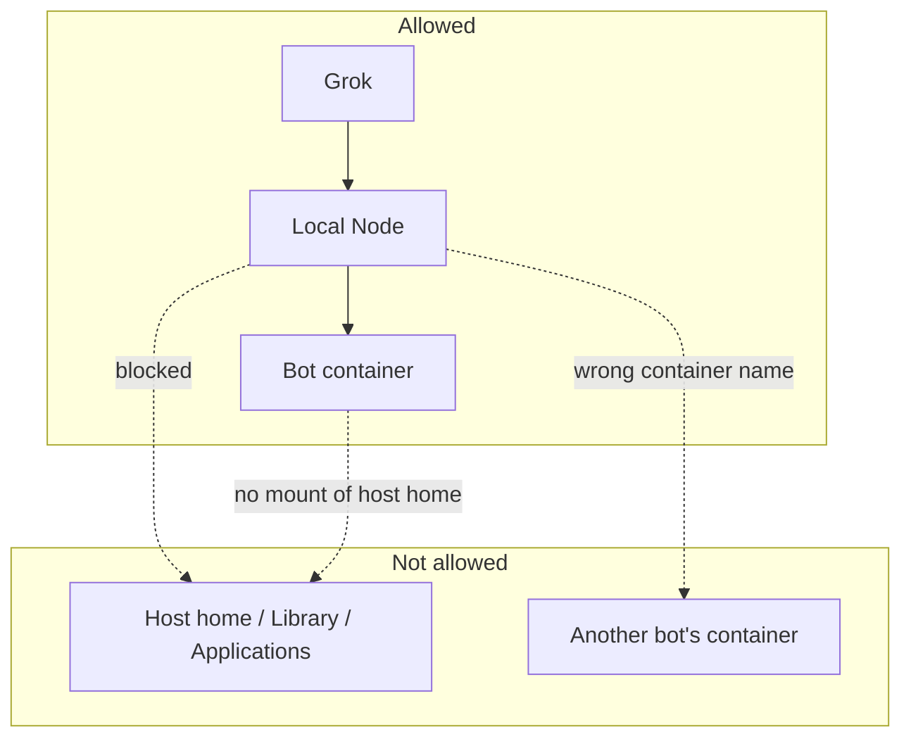

- Shell commands mentioning `/Users` are rejected
- Computer actions require `vm.container` starting with `localbot-`
- API is bound to localhost

---

## 15. How to extend

| Want | Where |
|---|---|
| New face | `EXPRESSIONS` in `web/grok-bot.js` |
| New motion | `ANIMATIONS` + `_updateAnim` |
| New body | `BODIES` + `_shapeVertex` / tentacle curve |
| New color | `web/palette.js` |
| New tool | `TOOLS` + handler in `agent.mjs` |
| New API | route in `server/index.mjs` + `app.js` |
| Prompt change | `prompts/*.txt` |
| Default look | `LOOK_DEFAULTS` in `avatar.js` |

---

## 16. Mental model

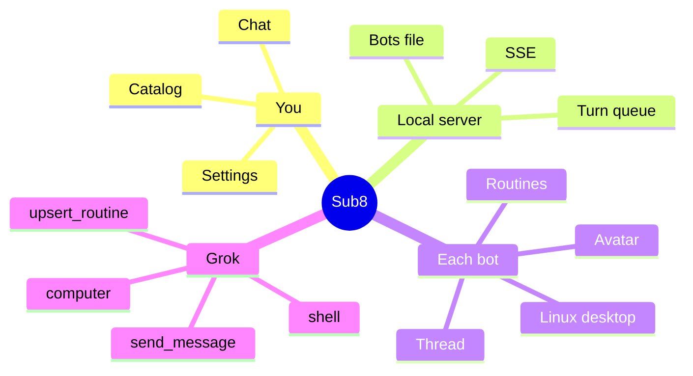

If you only remember one picture: **a thin Electron window over a local API that rents each bot its own Linux box and asks Grok what to do there.**
